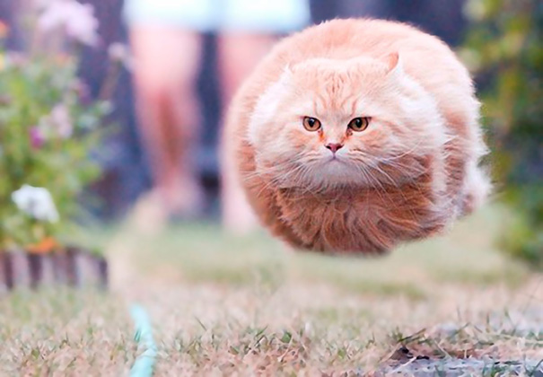

Sigh
This is not broken [the second link](funny-perfectly-timed-cat-photo-50__605.jpg "toooll")
This image does not exist [1234](intunearchitecture.png)
This image does not get synced [4312](intunearchitecture.svg)
View a [asdfasdfsdfasdf](./media/intunearchitecture.svg) of the Intune architecture diagram.
This image is a link [9j9j](image.png)

this file was updated in repo and should generate new version
